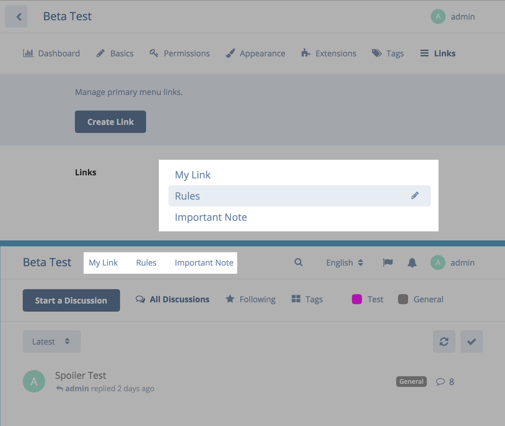

# Flarum Links

Manage Flarum primary navigation links.



## Installation

Run below command while you're in Flarum root folder:

```sh
composer require sijad/flarum-ext-links
```

## TODO List
* Add autolinks to tags, posts, users, etc.
* Add sub items
* Add permission 
